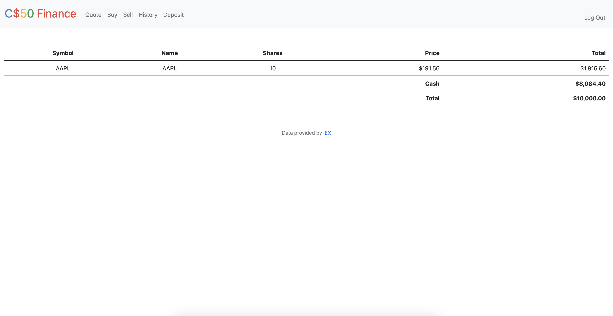

# CS50X Finance

## Project Description
The "CS50X Finance" program is a Flask web application that simulates a stock trading platform. Users can register, log in, view their portfolio, buy and sell stocks, and check transaction history. The application leverages the CS50 Library, Flask, and SQLite database for functionality. It provides the following functionalities:

1. **User Authentication:** Users can register by providing a unique username and password, and the application offers log-in and log-out functionalities with secure password hashing for enhanced security. User sessions are effectively managed through Flask-Session, ensuring a secure and persistent user experience.
2. **Portfolio Display:** The "/" route in the application displays the user's portfolio of stocks, presenting the user's cash balance, a summary of owned stocks, and the total account balance. This information is retrieved from the SQLite database and dynamically rendered using Jinja templates to provide an interactive and up-to-date view of the user's financial status.
3. **Transaction History:** The "/history" route provides a comprehensive transaction history, presenting details such as stock symbol, name, shares, price, and timestamp. Transactions are categorized as either purchases or sales, enhancing clarity for the user and offering a complete overview of their trading activity.
4. **Stock Quote Lookup:** The "/quote" route enables users to retrieve stock quotes by entering a stock symbol. Real-time stock information is obtained using the lookup function, and the details are presented to the user, enhancing their ability to make informed investment decisions.
5. **Cash Deposit:** Through the "/deposit" route, users have the capability to deposit cash into their accounts. The deposited amount undergoes validation, ensuring accuracy, and subsequently, the user's cash balance is updated in the database for accurate financial tracking.
6. **Stock Buying:** Users have the ability to buy stocks through the "/buy" route by specifying the stock symbol and the desired number of shares. Input validation is implemented to ensure the accuracy of user inputs, and appropriate error messages are displayed when necessary. The details of the transaction are then recorded in the database, effectively updating the user's cash balance to reflect the purchase.
7. **Stock Selling:** Through the "/sell" route, users can sell stocks they own by choosing the stock symbol and indicating the quantity of shares to sell. The application ensures the validity of user input, verifies if the user possesses an adequate number of shares, and records the details of the sale transaction in the system.

The code design choices include using the Flask framework for its lightweight and modular features, employing SQLite as a suitable database backend, implementing Jinja templating for dynamic content rendering, ensuring password security through Werkzeug's hashing functions, utilizing the CS50 Library for database interactions, incorporating an API lookup function for real-time stock data, managing sessions with Flask-Session, implementing input validation for data integrity, and adopting responsive design principles for accessibility across different devices and screen sizes.

### Project Structure:
* app.py
* helpers.py
* README.md
* requirements.txt
* templates (html)
* static (css and icon)
    

### Functions
**index** - The index function in the Flask application displays the user's portfolio of stocks. It retrieves the user's cash balance from the database and aggregates the user's stock holdings, calculating the total value of each stock and the overall account balance. The information is then rendered dynamically using Jinja templates in the index.html file, providing the user with a clear overview of their portfolio.

**login** - The login function in the Flask application handles user authentication. It validates form data, checks credentials against the database, and manages user sessions. If the request is a POST with valid credentials, it logs in the user by storing their ID in the session and redirects them to the home page. For GET requests, it renders the login page.

**register** - The register function in the Flask application facilitates user registration. It processes POST requests, validating and storing user-provided data such as username and password. It ensures that the username is unique, passwords match, and required fields are filled. Upon successful registration, the user's credentials are securely hashed and stored in the database, and the user is redirected to the home page. For GET requests, it renders the registration page. 

**quote** - The /quote route in the Flask application provides functionality for obtaining stock quotes. When accessed via a POST request, it retrieves the stock symbol submitted by the user, looks up real-time stock information using the lookup function, and renders the information in a template. It includes input validation to handle cases of missing or invalid symbols. For GET requests, it renders the initial page for entering stock symbols.

**history** - The history function in the Flask application retrieves transaction history for the logged-in user from the SQLite database. It selects relevant details such as stock symbol, name, shares, price, and timestamp for each transaction. The function then iterates through the retrieved orders, adding a "status" field to distinguish between bought and sold transactions based on the number of shares. Finally, it renders a template (history.html) with the processed transaction data for display.

**deposit** - The deposit function in the Flask application handles user deposits. If the request method is POST, it attempts to retrieve and validate the deposited amount from the form. If the amount is valid, it updates the user's cash balance in the database and redirects them to the home page. If the method is not POST, it renders the deposit template (deposit.html) for the user to input the deposit amount. This function ensures that the deposited amount is a positive integer.

**buy** - The buy function in the Flask application allows users to purchase shares of stock. When accessed through the "/buy" route, it validates the user's input for the stock symbol and the number of shares. It checks if the symbol is provided and valid, and if the number of shares is a positive integer. The function then queries the database to determine the user's available cash and calculates the cost of the stock purchase. If the user has sufficient funds, it updates the user's cash balance, records the transaction in the database, and redirects the user to the home page ("/"). If any input is invalid or the balance is insufficient, appropriate error messages are returned. In the case of a GET request, the function renders the "buy.html" template.

**sell** - The sell function in the Flask application allows users to sell shares of stock. When accessed through the "/sell" route, the function validates the user's input for the stock symbol and the number of shares to sell. It checks if the shares are provided and form a valid positive integer. The function then queries the database to determine the user's owned shares for the specified symbol and calculates the total value of the shares to be sold. If the user has enough shares, it records the sale transaction in the database, updates the user's cash balance, and redirects the user to the home page ("/"). If the input is invalid or the user doesn't have enough shares, appropriate error messages are returned. In the case of a GET request, the function renders the "sell.html" template, providing a list of available symbols for selling.

---

## Requirements
Before you can use this program, you'll need to ensure that you have the following requirements installed:
- Python 3.x
- Python Packages:
    - 'cs50'
    - 'Flask'
    - 'Flask-Session'
    - 'requests'

To install the python packages: `pip install -r requirements.txt`

---

## How to use the Program
1. Clone the repository or download the code.

2. Run the web application by executing the Flask command:

    `flask run`

    make sure you are in the correct directory before running the above command.

---

## How It Works
The web application fetches real-time stock information by querying an external API using the lookup function, ensuring accurate and up-to-date data for user transactions.

**User Registration and Authentication**
* Users can register with a unique username and password.
* Handles user registration and login, with proper password hashing for security.
* Store the users information in a database.

**Stock Quote Lookup**
* Allows the user to search for any available stock quotes.
* Uses the lookup function to fetch real-time information about the stock based on the entered symbol..
* Displays the stocks price.

**Buying Stocks**
* Facilitates the purchase of stocks by the user.
* Validates the entered number of shares, ensuring it is a positive integer.
* Checks the user's available cash balance to ensure it is sufficient for the purchase.
* Updates the user's cash balance in the database after deducting the cost of the purchased shares.
* Records the stock purchase transaction in the database.

**Selling Stocks**
* Enables the user to sell shares of a stock.
* Checks if the entered shares are missing or if the number of shares is not a positive integer.
* Checks if the user has enough shares of the specified stock to sell.
* Records the stock sale transaction in the database with negative shares to represent the sale.
* Calculates the amount gained from the sale and updates the user's cash balance in the database.

---

## Screenshots

**Register/Login**

**Index**

**Buy*

**Sell**

**History**

